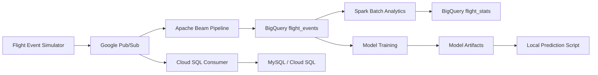

<div align="center">


# Flight Delay Simulator and Analytics Pipeline

<p>
  
  
  
  
  
</p>

<p>
  Simulate live flight events, stream them through Google Cloud, analyze delay patterns, and train a machine learning model for delay prediction.
</p>

</div>

---

## Live System Flow



## Highlights

- Real-time flight event generation with route, airline, status, delay reason, and UTC timestamps.
- Pub/Sub based event streaming for cloud-native ingestion.
- Apache Beam pipeline for writing streaming messages into BigQuery.
- MySQL/Cloud SQL consumer for relational storage.
- PySpark analytics for airport, route, airline, and delay-reason summaries.
- Random Forest model training from BigQuery data.
- Local inference script using saved model artifacts.
- Environment-variable based configuration so secrets stay out of source control.

## Tech Stack

<div align="center">


</div>

| Layer | Tools |
| --- | --- |
| Event simulation | Python |
| Streaming | Google Cloud Pub/Sub |
| Stream processing | Apache Beam |
| Warehouse | BigQuery |
| Relational sink | MySQL / Cloud SQL |
| Batch analytics | PySpark, Dataproc |
| Orchestration | Airflow |
| Machine learning | pandas, scikit-learn |
| Model storage | Local artifacts, Google Cloud Storage |

## Project Structure

```text
.
+-- flight_simulator.py      # Generates and publishes flight events to Pub/Sub
+-- Data_floww.py            # Apache Beam pipeline: Pub/Sub to BigQuery
+-- cloudsql_consumer.py     # Pub/Sub subscriber that writes events to MySQL/Cloud SQL
+-- verify_messages.py       # Short Pub/Sub subscriber for message verification
+-- spark_batch.py           # PySpark batch analytics job using BigQuery
+-- flight_dag.py            # Airflow DAG for Dataproc Spark execution
+-- train_deploy.py          # Training, local model save, optional GCS upload
+-- predict.py               # Local model inference from saved artifacts
+-- requirements.txt         # Python dependencies
+-- sample.ipynb             # Placeholder notebook
+-- .gitignore               # Keeps credentials, caches, venvs, and artifacts out of Git
```

## Event Schema

```json
{
  "flight_id": "6E123",
  "airline": "IndiGo",
  "origin": "DEL",
  "destination": "BOM",
  "scheduled_time": "2026-05-23T10:00:00+00:00",
  "delay_minutes": 30,
  "status": "DELAYED",
  "delay_reason": "weather",
  "event_timestamp": "2026-05-23T09:00:00+00:00"
}
```

## Setup

Clone the repository and create a virtual environment:

```powershell
git clone https://github.com/YOUR_USERNAME/YOUR_REPOSITORY.git
cd YOUR_REPOSITORY
python -m venv .venv
.\.venv\Scripts\activate
pip install -r requirements.txt
```

Authenticate with Google Cloud:

```powershell
gcloud auth application-default login
gcloud config set project YOUR_GCP_PROJECT_ID
```

## Configuration

Set real values through environment variables. Do not hard-code secrets in source files.

| Variable | Required For | Description |
| --- | --- | --- |
| `PROJECT_ID` | Most scripts | Google Cloud project ID |
| `TOPIC_ID` | `flight_simulator.py` | Pub/Sub topic for generated events |
| `SUBSCRIPTION_ID` | `cloudsql_consumer.py`, `verify_messages.py` | Pub/Sub subscription ID |
| `PUBSUB_SUBSCRIPTION` | `Data_floww.py` | Full Pub/Sub subscription path |
| `BIGQUERY_TABLE` | `Data_floww.py` | BigQuery output table in `project:dataset.table` format |
| `BIGQUERY_DATASET` | `spark_batch.py` | BigQuery dataset name |
| `INPUT_TABLE` | `spark_batch.py` | Spark BigQuery input table |
| `OUTPUT_TABLE` | `spark_batch.py` | Spark BigQuery output table |
| `TEMP_BUCKET` | `spark_batch.py` | Temporary GCS bucket for the BigQuery connector |
| `MODEL_BUCKET` | `train_deploy.py` | GCS bucket for trained model artifacts |
| `MYSQL_HOST` | `cloudsql_consumer.py` | MySQL or Cloud SQL host |
| `MYSQL_USER` | `cloudsql_consumer.py` | MySQL username |
| `MYSQL_PASSWORD` | `cloudsql_consumer.py` | MySQL password |
| `MYSQL_DB` | `cloudsql_consumer.py` | MySQL database name |
| `DATAPROC_REGION` | `flight_dag.py` | Dataproc region |
| `DATAPROC_ZONE` | `flight_dag.py` | Dataproc zone |
| `DATAPROC_CLUSTER` | `flight_dag.py` | Dataproc cluster name |
| `GCS_BUCKET` | `flight_dag.py` | Bucket containing Spark job files |

PowerShell example:

```powershell
$env:PROJECT_ID="my-gcp-project"
$env:TOPIC_ID="flight-events"
$env:SUBSCRIPTION_ID="flight-events-sub"
$env:MYSQL_HOST="127.0.0.1"
$env:MYSQL_USER="flight_user"
$env:MYSQL_PASSWORD="your-secure-password"
$env:MYSQL_DB="flight_db"
```

## Run The Pipeline

Publish simulated flight events:

```powershell
python flight_simulator.py
```

Verify Pub/Sub delivery:

```powershell
python verify_messages.py
```

Stream Pub/Sub events into BigQuery:

```powershell
python Data_floww.py
```

Stream Pub/Sub events into MySQL or Cloud SQL:

```powershell
python cloudsql_consumer.py
```

Run Spark analytics:

```powershell
python spark_batch.py
```

Train and upload the model:

```powershell
python train_deploy.py
```

Run local predictions:

```powershell
python predict.py
```

## Prediction Output

```text
Flight: DEL -> BOM | Airline: IndiGo
Prediction : ON_TIME
Delay probability  : 26.7%
On-time probability: 73.3%
--------------------------------------------------
```

## GitHub Upload Safety

This project is prepared for public upload, but keep these files out of GitHub:

```text
.venv/
.venv311/
.idea/
__pycache__/
data/
models/
model_artifacts/
.env
*.json
*.key
*.pem
```

The included `.gitignore` already excludes these paths. If any real password, service account key, or API token was ever committed, rotate it immediately.

## Validation Status

| Check | Status |
| --- | --- |
| Python syntax parse | Passed |
| Event generation smoke test | Passed |
| Local prediction smoke test | Passed |
| Full cloud run | Requires configured GCP resources |
| Spark/Airflow run | Requires installed runtime and cloud setup |

## Roadmap

- Add Terraform or deployment scripts for reproducible GCP infrastructure.
- Add unit tests for event generation and message parsing.
- Add CI checks for linting, secret scanning, and syntax validation.
- Replace local pickle artifacts with a safer model registry workflow.
- Add a dashboard layer for delay analytics.

## License

Add a license before publishing this repository publicly if you want others to reuse or modify it.

---

<div align="center">

Built for real-time flight data simulation, streaming analytics, and ML-powered delay prediction.

</div>
